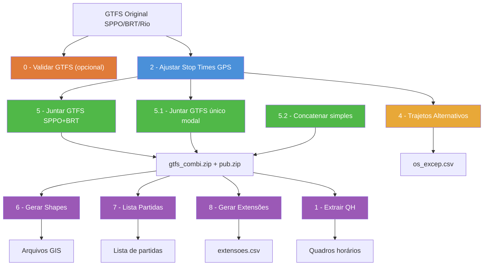

# Resumo dos Códigos Python — `codigos_py/`

Os scripts formam um **pipeline sequencial** de processamento de dados GTFS para o transporte público do Rio de Janeiro. Cada script lê a saída do anterior e produz insumos para o próximo.

---

## 0️⃣ `0_validar_gtfs_entrada.py`
**Objetivo:** Validar a integridade do GTFS de entrada **antes** de iniciar o pipeline de processamento, detectando problemas antecipadamente.

| Item | Descrição |
|------|-----------|
| **Entrada** | Arquivo GTFS ZIP original (SPPO, BRT ou Rio) — tabelas `routes.txt`, `trips.txt`, `stop_times.txt`, `calendar.txt`, `calendar_dates.txt`, `shapes.txt` |
| **Validações** | 1. Todas as routes possuem pelo menos uma trip associada |
|  | 2. Trips de excepcionalidade (com `[...]` no `trip_headsign`) seguem o padrão: sem acentos, espaços substituídos por `_`, apenas minúsculas e caracteres `[a-z0-9_]` |
|  | 3. (Extra) Trips sem `route_id` preenchido |
|  | 4. (Extra) Inventário de `service_id` utilizados |
| **Saída** | Relatório CSV com timestamp em `resultados/validacoes_snapshot/validacao_gtfs_entrada_<tipo>_<sufixo>_<timestamp>.csv` |
| **Retorno** | `sys.exit(0)` se todas as validações críticas passaram; `sys.exit(1)` se houver falhas |
| **Dependências** | `pandas`, `zipfile`, `re`, `unicodedata`, `pathlib` |

> [!TIP]
> Execute este script antes do `2_ajustar_stop_times.py`. Ele gera sugestões automáticas de correção para os `trip_headsign` fora do padrão.

---

## 1️⃣ `1_extrair_qh_especificado_no_gtfs.py`
**Objetivo:** Extrair o Quadro Horário (QH) de linhas específicas, a partir do GTFS combinado.

| Item | Descrição |
|------|-----------|
| **Entrada** | Arquivo GTFS ZIP combinado (`gtfs_combi_YYYY-MM-QQ.zip`) — tabelas `frequencies.txt` e `trips.txt` |
| **Filtros** | Lista de linhas (`linhas_rodar`) e calendários (`services_to_run`, ex: `U_REG`, `S_REG`, `D_REG`) |
| **Processamento** | Junta `frequencies` com `trips`, filtra por linha e serviço, identifica combinações únicas de (serviço, vista, calendário) |
| **Saída** | Um CSV por combinação em `resultados/quadro_horario_extraido/YYYY/MM/qh_por_linha/QQ/` com colunas: `trip_id`, `trip_headsign`, `trip_short_name`, `start_time`, `end_time`, `headway_secs` |
| **Dependências** | `pandas`, `zipfile`, `pathlib` |

---

## 2️⃣ `2_ajustar_stop_times.py`
**Objetivo:** Recalcular os horários de parada (`stop_times`) do GTFS usando **velocidades reais extraídas de dados GPS** de viagens realizadas.

| Item | Descrição |
|------|-----------|
| **Entrada** | GTFS original (SPPO ou BRT) + dados de viagens reais (Parquet/CSV) + calendário de feriados (`calendario.json`) |
| **Etapas** | 1. Carrega viagens GPS (BRT=CSV, SPPO=Parquet + Frescão) |
|  | 2. Calcula sumários de velocidade média por (serviço, direção, hora, tipo de dia) com remoção de outliers via IQR |
|  | 3. Lê GTFS, ajusta `shape_dist_traveled` para começar em 0, corrige horários faltantes usando distância + velocidade padrão |
|  | 4. Recalcula `arrival_time`/`departure_time` usando velocidades GPS reais, garantindo monotonicidade |
|  | 5. Valida integridade (nenhum horário vazio/nulo) |
| **Saída** | Novo ZIP GTFS com sufixo `_PROC.zip` (apenas `stop_times.txt` e `routes.txt` são substituídos) |
| **Dependências** | `pandas`, `numpy`, `zipfile`, `json` |

> [!IMPORTANT]
> Este é o script mais complexo do pipeline (~584 linhas). Ele é o coração do ajuste de qualidade do GTFS.

---

~~## 3️⃣ `3_desvios_nao-utilizar.py`~~

> Este código está datado e **não tem mais utilidade**. Usar `4_trajetos_alternativos.py` para trabalhar com excepcionalidades.

---

## 4️⃣ `4_trajetos_alternativos.py`
**Objetivo:** Gerar um **relatório CSV** dos trajetos alternativos (desvios), listando serviços, vistas, consórcios, sentidos e extensões em km.

| Item | Descrição |
|------|-----------|
| **Entrada** | GTFS processado (`_PROC.zip`) — tabelas `trips`, `routes`, `agency`, `shapes` |
| **Processamento** | 1. Identifica viagens de desvio (trip_headsign contendo `[...]`) |
|  | 2. Remove frescões (`route_type == 200`) |
|  | 3. Calcula extensão geográfica dos shapes via GIS (projeção EPSG:31983) |
|  | 4. Agrupa por (serviço, vista, consórcio, sentido, evento) |
| **Saída** | CSV em `dados/os/os_YYYY-MM-QQ_excep.csv` com colunas: Serviço, Vista, Consórcio, Sentido, Extensão, Evento |
| **Dependências** | `pandas`, `geopandas`, `shapely` |

---

## 5️⃣ `5_juntar_gtfs.py`
**Objetivo:** **Combinar** os GTFS processados do SPPO e do BRT em um único GTFS unificado, aplicar limpezas, cores e gerar versão pública.

| Item | Descrição |
|------|-----------|
| **Entrada** | `sppo_YYYY-MM-QQ_PROC.zip` + `brt_YYYY-MM-QQ_PROC.zip` + insumos (cores, trip_id_fantasma, arquivos de substituição) |
| **Etapas** | 1. Carrega e processa SPPO: define `route_type` (700/200), ajusta `service_id`, remove trips fantasma e sem stop_times |
|  | 2. Carrega e processa BRT: preserva `route_type` original, ajusta `service_id` |
|  | 3. Concatena todos os arquivos GTFS (trips, routes, stops, shapes, etc.) |
|  | 4. Limpeza: remove paradas "APAGAR", colunas desnecessárias, ordena shapes, valida horários |
|  | 5. Salva GTFS combinado e substitui arquivos (calendar_dates, fare_attributes, fare_rules, feed_info) com insumos externos |
|  | 6. Gera versão pública: remove trips EXCEP, aplica cores personalizadas (`gtfs_cores.csv`), salva `gtfs_rio-de-janeiro_pub.zip` |
| **Saída** | `gtfs_combi_YYYY-MM-QQ.zip` (interno) + `gtfs_rio-de-janeiro_pub.zip` (público) |
| **Dependências** | `pandas`, `numpy`, `zipfile` |

> [!TIP]
> A função `clean_gtfs()` implementa uma limpeza em cascata equivalente ao `gtfstools::filter_by_trip_id` do R — remove registros órfãos de todas as tabelas associadas.

---

## 5️⃣.1️⃣ `5.1_juntar_gtfs_sppo.py`
**Objetivo:** Variante do script 5 para processar **um único GTFS** (SPPO, BRT ou Rio), sem combinar com outro modal. Gera o GTFS combinado e público a partir de uma única fonte.

| Item | Descrição |
|------|-----------|
| **Entrada** | Um único GTFS processado (`_PROC.zip`) do tipo `sppo`, `brt` ou `rio` + insumos de substituição |
| **Diferencial** | Suporta múltiplas **etapas** do GTFS Rio (ex: `"ETAPA_01,ETAPA_02"`), agregando `calendar_dates` e demais arquivos de substituição de múltiplas pastas |
| **Etapas** | Idênticas ao script 5, mas para uma única fonte (sem etapa de combinação SPPO+BRT) |
| **Pastas de substituição** | Resolução hierárquica: busca pastas específicas por etapa, com fallback para a pasta base |
| **Saída** | `gtfs_combi_YYYY-MM-QQ.zip` (interno) + `gtfs_rio-de-janeiro_pub.zip` (público) |
| **Dependências** | `pandas`, `numpy`, `zipfile` |

> [!NOTE]
> Use este script quando apenas **um modal** (ex: somente Rio) precisa ser publicado, sem combinar SPPO+BRT.

---

## 5️⃣.2️⃣ `5.2_juntar_gtfs_simples.py`
**Objetivo:** Concatenação simples de **N arquivos GTFS ZIP** em um único arquivo, sem limpezas avançadas ou lógica de negócio. Útil para testes e inspeções rápidas.

| Item | Descrição |
|------|-----------|
| **Entrada** | Lista de arquivos GTFS ZIP (`INPUT_ZIPS`) configurada diretamente no script |
| **Processamento** | 1. Lê todos os ZIPs e concatena cada tabela `.txt` |
|  | 2. Remove linhas exatamente duplicadas de cada tabela |
| **Saída** | Um único ZIP em `OUTPUT_ZIP` configurado no script |
| **Dependências** | `pandas`, `zipfile` |

---

## 6️⃣ `6_gerar_shapes.py`
**Objetivo:** Gerar **arquivos geoespaciais** (Shapefile + GeoPackage) dos trajetos (linhas) e pontos de parada a partir do GTFS público.

| Item | Descrição |
|------|-----------|
| **Entrada** | GTFS público (`gtfs_rio-de-janeiro_pub.zip`) + `descricao_desvios.csv` (opcional) |
| **Processamento** | 1. Ordena shapes e remove inválidos (< 2 pontos) |
|  | 2. Prioriza shapes por tipo de serviço: U_REG → *_REG → especial U → outros |
|  | 3. Converte coordenadas em `LineString`, projeta para EPSG:31983, calcula extensão |
|  | 4. Enriquece com metadados: consórcio, tipo de rota (regular/BRT/frescão), tarifas, descrição de desvios |
|  | 5. Exporta trajetos (linhas) e pontos de parada |
| **Saída** | Em `dados/shapes/YYYY/`: |
|  | - `shapes_trajetos_YYYY-MM-QQ.shp` + `.gpkg` (trajetos como LineStrings) |
|  | - `shapes_pontos_YYYY-MM-QQ.shp` + `.gpkg` (paradas como Points, com `route_type` agregado) |
| **Dependências** | `pandas`, `numpy`, `geopandas`, `shapely`, `pyogrio` |

---

## 7️⃣ `7_lista_partidas.py`
**Objetivo:** Gerar a **lista completa de partidas** (horários de saída) por tipo de dia, consolidando viagens por frequência e por quadro horário regular.

| Item | Descrição |
|------|-----------|
| **Entrada** | GTFS público (`gtfs_rio-de-janeiro_pub.zip`) |
| **Processamento** | 1. Filtra frescões e trips fantasma |
|  | 2. Calcula extensões dos shapes via GIS (EPSG:31983) |
|  | 3. Para cada tipo de dia (DU/SAB/DOM): |
|  |    a. Expande `frequencies.txt` em partidas individuais (start → end, incrementando headway) |
|  |    b. Extrai horários do primeiro ponto (`stop_sequence=0`) para linhas sem frequência |
|  |    c. Enriquece com nome da rota, agência, extensão, faixa horária |
|  |    d. Calcula intervalos entre partidas consecutivas |
| **Saída** | Em `resultados/partidas/`: |
|  | - `partidas_du.csv`, `partidas_sab.csv`, `partidas_dom.csv` (individuais com intervalo) |
|  | - `partidas.csv` + `partidas.parquet` (consolidado de todos os dias) |
| **Dependências** | `pandas`, `numpy`, `geopandas`, `shapely`, `pyarrow` |

---

## 8️⃣ `8_gerar_extensoes.py`
**Objetivo:** Gerar uma listagem consolidada de linhas por sentido e vista, com o cálculo da maior extensão (em metros) para cada serviço.

| Item | Descrição |
|------|-----------|
| **Entrada** | GTFS público (`gtfs_rio-de-janeiro_pub.zip`) |
| **Processamento** | 1. Filtra rotas SPPO (route_type=3 ou 700). |
|  | 2. Remove viagens de exceção/desvio. |
|  | 3. Calcula extensões geográficas de todos os shapes (EPSG:31983). |
|  | 4. Consolida a maior extensão por (Serviço, Vista, Sentido). |
| **Saída** | CSV em `resultados/extensoes/extensoes_YYYY-MM-QQQ.csv` |
| **Dependências** | `pandas`, `geopandas`, `shapely` |

---

## 8️⃣.1️⃣ `8.1_gerar_extensoes_rio.py`
**Objetivo:** Variante do script 8 para processar arquivos GTFS no formato simplificado `rio_YYYY-MM.zip`.

| Item | Descrição |
|------|-----------|
| **Entrada** | GTFS em `dados/gtfs/YYYY/rio_YYYY-MM.zip` |
| **Processamento** | Idêntico ao script 8, mas adaptado para o novo padrão de nomenclatura de arquivos. |
| **Saída** | CSV em `resultados/extensoes/extensoes_rio_YYYY-MM.csv` |

---

## 📊 Visão Geral do Pipeline

> [!NOTE]
> O script **0** é opcional mas recomendado antes de iniciar o pipeline. O script **2** é a entrada principal para todos os modais. Os scripts **5**, **5.1** e **5.2** são alternativas de combinação; use o mais adequado ao contexto. Os scripts **4**, **6**, **7**, **8** e **8.1** são etapas de pós-processamento/exportação independentes.
