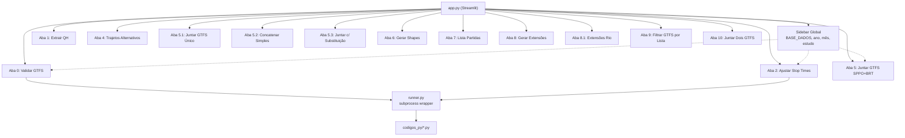
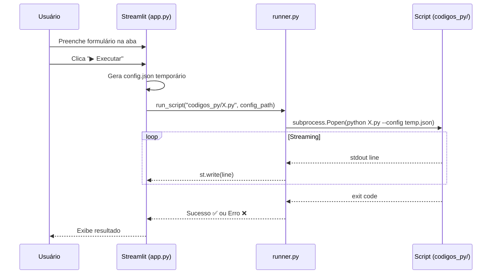

# Aplicação Streamlit — Pipeline GTFS

## Objetivo

Criar uma aplicação web local em **Streamlit** que unifique todos os scripts do pipeline de processamento GTFS (`codigos_py/`) em uma interface gráfica com abas. O usuário poderá configurar os parâmetros (que hoje são editados diretamente no código-fonte) via formulários e executar cada etapa individualmente, acompanhando os logs de saída em tempo real.

## Finalidade

- **Eliminar a necessidade de editar código** para alterar parâmetros como `ano_gtfs`, `mes_gtfs`, `estudo_gtfs`, caminhos de arquivos, etc.
- **Centralizar a execução** de todas as etapas do pipeline em um só lugar.
- **Visualizar logs e resultados** diretamente na interface.
- **Reduzir erros operacionais** causados por configurações inconsistentes entre scripts.

---

## Arquitetura



### Decisão Técnica Principal

> A aplicação **NÃO** importará os scripts como módulos Python. Em vez disso, cada aba gerará um arquivo de configuração temporário (JSON) e invocará o script original via `subprocess`, capturando `stdout`/`stderr` em tempo real.

**Justificativa:**
- Os scripts existentes usam `print()`, `raise`, `sys.exit()` e código procedural no nível do módulo — importá-los diretamente causaria efeitos colaterais.
- Não é necessário refatorar os scripts existentes; a aplicação será uma **camada de interface** sobre o pipeline atual.
- Cada script será levemente adaptado para aceitar um arquivo JSON de configuração via argumento de linha de comando (`--config`), com fallback para as constantes hardcoded já existentes.

---

## Estrutura de Arquivos

```
processar_gtfs/
├── src/
│   └── app.py                    # [NEW] Entrada Streamlit (st.set_page_config + abas)
│   └── runner.py                 # [NEW] Wrapper de execução (subprocess + streaming de logs)
│   └── tabs/
│       ├── __init__.py           # [NEW]
│       ├── tab_0_validar.py      # [NEW]
│       ├── tab_1_extrair_qh.py   # [NEW]
│       ├── tab_2_ajustar_st.py   # [NEW]
│       ├── tab_4_trajetos.py     # [NEW]
│       ├── tab_5_juntar.py       # [NEW]
│       ├── tab_5_1_juntar_unico.py  # [NEW]
│       ├── tab_5_2_concatenar.py # [NEW]
│       ├── tab_5_3_substituicao.py  # [NEW]
│       ├── tab_6_shapes.py       # [NEW]
│       ├── tab_7_partidas.py     # [NEW]
│       ├── tab_8_extensoes.py    # [NEW]
│       ├── tab_8_1_extensoes_rio.py # [NEW]
│       ├── tab_9_filtrar.py      # [NEW]
│       └── tab_10_juntar_dois.py # [NEW]
├── codigos_py/                   # [MODIFY] Adaptações mínimas para aceitar --config
│   ├── 0_validar_gtfs_entrada.py
│   ├── 1_extrair_qh_especificado_no_gtfs.py
│   ├── 2_ajustar_stop_times.py
│   ├── ...
├── requirements.txt              # [MODIFY] Adicionar streamlit
```

---

## Mapeamento de Parâmetros por Aba

### Parâmetros Globais (Sidebar)

Estes parâmetros são compartilhados por praticamente todos os scripts e ficam na sidebar:

| Parâmetro | Widget | Padrão | Scripts que usam |
|-----------|--------|--------|-----------------|
| `BASE_DADOS` | `text_input` | `C:/R_SMTR/dados` | Todos |
| `BASE_RESULTADOS` | `text_input` | `C:/R_SMTR/resultados` | 1, 7, 8, 8.1 |
| `ano_gtfs` | `text_input` | `2026` | Todos |
| `mes_gtfs` | `text_input` | `08` | 0, 1, 2, 4, 5, 5.1, 6, 8 |
| `estudo_gtfs` | `text_input` | `02` | 0, 1, 2, 4, 5, 5.1, 6, 8, 9, 10 |
| `gtfs_processar` | `selectbox` (`sppo`, `brt`, `rio`) | `sppo` | 0, 2, 5, 5.1 |

---

### Parâmetros Específicos por Aba

#### Aba 0 — Validar GTFS
| Parâmetro | Widget | Descrição |
|-----------|--------|-----------|
| `endereco_gtfs` | `text_input` (auto-preenchido via sufixo) | Caminho do GTFS ZIP de entrada |

#### Aba 1 — Extrair QH
| Parâmetro | Widget | Descrição |
|-----------|--------|-----------|
| `linhas_rodar` | `text_input` (lista separada por vírgula) | Linhas a extrair (ex: `371,624,SN624`) |
| `services_to_run` | `multiselect` (`U_REG`, `S_REG`, `D_REG`, `EXCEP`) | Calendários alvo |

#### Aba 2 — Ajustar Stop Times
| Parâmetro | Widget | Descrição |
|-----------|--------|-----------|
| `ano_velocidade` | `text_input` | Ano dos dados de velocidade GPS |
| `mes_velocidade` | `text_input` | Mês dos dados de velocidade GPS |
| `velocidade_padrao_kmh` | `number_input` | Velocidade padrão em km/h (default: 15.0) |

#### Aba 4 — Trajetos Alternativos
| Parâmetro | Widget | Descrição |
|-----------|--------|-----------|
| `CALENDARIOS_ALVO` | `multiselect` (`U`, `S`, `D`, `EXCEP`) | Calendários a filtrar |

#### Aba 5 — Juntar GTFS (SPPO+BRT)
| Parâmetro | Widget | Descrição |
|-----------|--------|-----------|
| `etapa_gtfs_rio` | `text_input` | Etapa(s) do GTFS Rio (ex: `ETAPA_01,ETAPA_02`) |
| `linhas_excluir` | `text_area` (lista separada por vírgula) | `trip_short_name`s a excluir |

#### Aba 5.1 — Juntar GTFS Único
| Parâmetro | Widget | Descrição |
|-----------|--------|-----------|
| `etapa_gtfs_rio` | `text_input` | Etapa(s) do GTFS Rio |

#### Aba 5.2 — Concatenar Simples
| Parâmetro | Widget | Descrição |
|-----------|--------|-----------|
| `INPUT_ZIPS` | `text_area` (um caminho por linha) | Lista de ZIPs de entrada |
| `OUTPUT_ZIP` | `text_input` | Caminho do ZIP de saída |

#### Aba 5.3 — Juntar com Substituição
| Parâmetro | Widget | Descrição |
|-----------|--------|-----------|
| `GTFS_1_PATH` | `text_input` | GTFS base |
| `GTFS_2_PATH` | `text_input` | GTFS que substitui as linhas em comum |
| `OUTPUT_ZIP` | `text_input` | Caminho do ZIP de saída |

#### Aba 6 — Gerar Shapes
| Parâmetro | Widget | Descrição |
|-----------|--------|-----------|
| `endereco_gtfs_combi` | `text_input` | Caminho do GTFS de entrada (combi ou pub) |

#### Aba 7 — Lista Partidas
| Parâmetro | Widget | Descrição |
|-----------|--------|-----------|
| `endereco_gtfs` | `text_input` | Caminho do GTFS de entrada |
| `tipos_dia` | `multiselect` (`du`, `sab`, `dom`) | Tipos de dia a processar |
| `linhas_excluir` | `text_area` | Linhas a excluir |

#### Aba 8 — Gerar Extensões
| Parâmetro | Widget | Descrição |
|-----------|--------|-----------|
| `endereco_gtfs` | `text_input` | Caminho do GTFS de entrada |

#### Aba 8.1 — Extensões Rio
| Parâmetro | Widget | Descrição |
|-----------|--------|-----------|
| `sufixo` | `text_input` | Sufixo do formato `rio_YYYY-MM` |

#### Aba 9 — Filtrar GTFS por Lista
| Parâmetro | Widget | Descrição |
|-----------|--------|-----------|
| `CALENDARIOS_ALVO` | `multiselect` | Calendários de filtro |
| `LISTA_FILTRO_RAW` | `text_area` (grande) | Tabela TSV com a lista de excepcionalidades |

#### Aba 10 — Juntar Dois GTFS
| Parâmetro | Widget | Descrição |
|-----------|--------|-----------|
| `GTFS_PRINCIPAL` | `text_input` | GTFS com precedência |
| `GTFS_SECUNDARIO` | `text_input` | GTFS complementar |
| `GTFS_SAIDA` | `text_input` | Caminho do resultado |

---

## Plano de Implementação — Ordem de Tarefas

### Fase 1 — Infraestrutura (2 tarefas)

| # | Tarefa | Descrição |
|---|--------|-----------|
| 1.1 | Instalar dependência | Adicionar `streamlit` ao `requirements.txt` e instalar no `.venv` |
| 1.2 | Criar `runner.py` | Módulo que executa scripts via `subprocess.Popen`, faz streaming do stdout para um `st.empty()` e retorna o código de saída |

### Fase 2 — Adaptação dos Scripts (1 tarefa)

| # | Tarefa | Descrição |
|---|--------|-----------|
| 2.1 | Adicionar suporte a `--config` | Em cada script em `codigos_py/`, adicionar no topo um bloco que lê um arquivo JSON de configuração (se passado via `--config`) e sobrescreve as variáveis de configuração correspondentes. Sem o argumento, o script funciona exatamente como antes — **sem quebra de comportamento**. |

> [!IMPORTANT]
> A alteração nos scripts é mínima e retrocompatível. Apenas o bloco de configuração no topo é adicionado. Todo o restante do código permanece inalterado.

### Fase 3 — Aplicação Streamlit (3 tarefas)

| # | Tarefa | Descrição |
|---|--------|-----------|
| 3.1 | Criar `app.py` | Entrada principal: `st.set_page_config`, sidebar com parâmetros globais, criação das abas via `st.tabs()` |
| 3.2 | Implementar módulos de aba | Criar cada `tab_*.py` com formulários específicos, botão "Executar" e área de logs |
| 3.3 | Testes e ajustes | Executar a aplicação, testar cada aba com dados reais, ajustar layout e UX |

### Fase 4 — Polish (1 tarefa)

| # | Tarefa | Descrição |
|---|--------|-----------|
| 4.1 | Refinamento visual e documentação | Adicionar ícones, tooltips, descrições de cada aba, e atualizar o README.md |

---

## Fluxo de Execução de uma Aba



---

## Open Questions

> [!IMPORTANT]
> **Agrupamento de abas**: Existem 14 scripts. Deseja agrupá-los de alguma forma (ex: scripts de combinação 5/5.1/5.2/5.3 em uma mesma aba com sub-seletor), ou prefere manter uma aba individual por script mesmo que a barra de abas fique extensa?

> [!IMPORTANT]
> **Lista de filtro do script 9**: A `LISTA_FILTRO_RAW` é um TSV grande embutido no código. Na aplicação Streamlit, prefere que ela seja editável via `text_area` ou que seja um **upload de arquivo CSV/TSV** que o usuário faz na interface?

> [!IMPORTANT]
> **Caminhos de arquivo**: Deseja manter os caminhos como `text_input` editáveis, ou prefere um **file picker** (`st.file_uploader`) para selecionar os ZIPs? Nota: `file_uploader` faz upload do arquivo para a memória, o que pode ser lento para ZIPs grandes (50MB+). A alternativa é um `text_input` com o caminho do sistema de arquivos.

---

## Plano de Verificação

### Verificação Automatizada
- Executar `streamlit run src/app.py` e verificar que a interface carrega sem erros.
- Testar pelo menos uma aba end-to-end (ex: script 0 — Validar GTFS) com dados reais.

### Verificação Manual
- Confirmar que os parâmetros globais da sidebar se propagam corretamente para cada aba.
- Confirmar que o streaming de logs funciona durante a execução.
- Confirmar que os scripts continuam funcionando normalmente quando executados diretamente via terminal (retrocompatibilidade).
